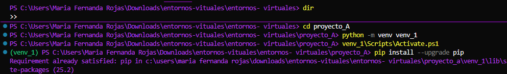

#  Entornos Virtuales 

##  Versión de Python utilizada
Python **3.13**

---

##  Descripción general de la actividad

Esta actividad tiene como objetivo **practicar la creación, activación y manejo de entornos virtuales en Python**, así como la instalación de paquetes, ejecución de scripts y notebooks, y la correcta organización de proyectos dentro de un repositorio en GitHub.

Se desarrollaron **dos proyectos independientes (A y B)**, cada uno con su propio entorno virtual y requerimientos:

- **Proyecto A:** Instalación y uso del paquete `jupyter`.
- **Proyecto B:** Instalación y uso del paquete `pandas`.

Cada entorno cuenta con su archivo `requirements.txt`, y se excluyeron las carpetas de los entornos virtuales mediante el archivo `.gitignore`.

---

##  Evidencias del proceso

###  1. Creación de los entornos virtuales
Se crearon los entornos y activaron `venv_1` y `venv_2` en las carpetas `proyecto_A` y `proyecto_B` respectivamente.




---


###  3. Instalación de paquetes (`jupyter` y `pandas`)
- En el **Proyecto A** se instaló el paquete `jupyter`.
- En el **Proyecto B** se instaló el paquete `pandas`.


---

###  4. Ejecución de scripts y notebooks
Se ejecutaron los scripts y notebooks correspondientes a cada proyecto dentro de sus entornos virtuales.


---

###  5. Contenido de los archivos `requirements.txt`

#### Proyecto A — `requirements.txt`
```text
jupyter==<versión_instalada>
entornos-virtuales/
│── imagenes/
│   ├── creacion_entorno.png
│   ├── activacion_entorno.png
│   ├── instalacion_paquetes.png
│   ├── ejecucion_notebook.png
│   └── estructura_proyecto.png
│
├── proyecto_A/
│   ├── venv_1/               
│   ├── src/
│   │   ├── algoritmo_a.py
│   │   └── notebook_a.ipynb
│   ├── requirements.txt
│   └── README_A.md
│
├── proyecto_B/
│   ├── venv_2/                
│   ├── src/
│   │   ├── algoritmo_b1.py
│   │   └── algoritmo_b2.py
│   ├── requirements.txt
│   └── README_B.md
│
├
├── .gitignore
├── README.md
└── requirements.txt

----
## Enlace al repositorio público de GitHub

 https://github.com/Mariaferrojas/entornos-virtuales